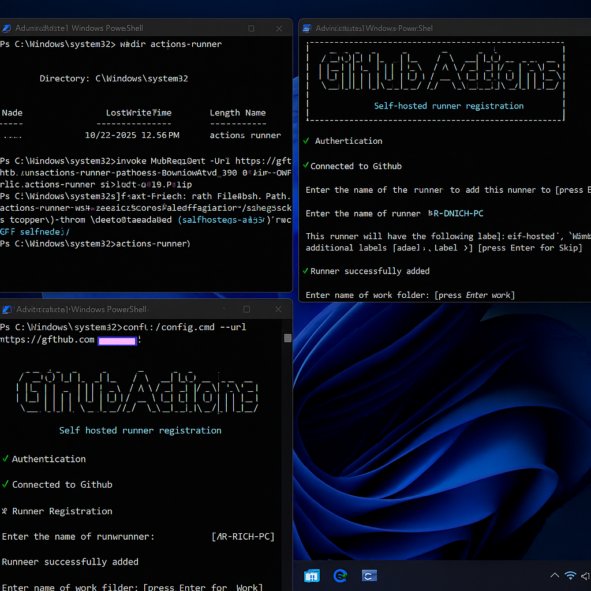
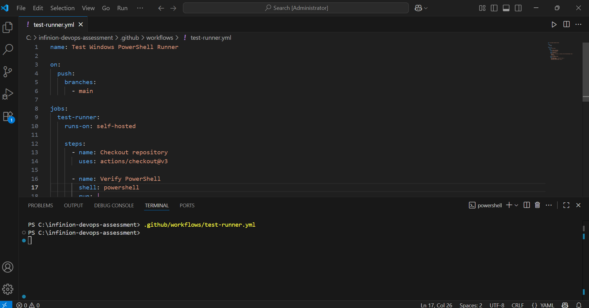
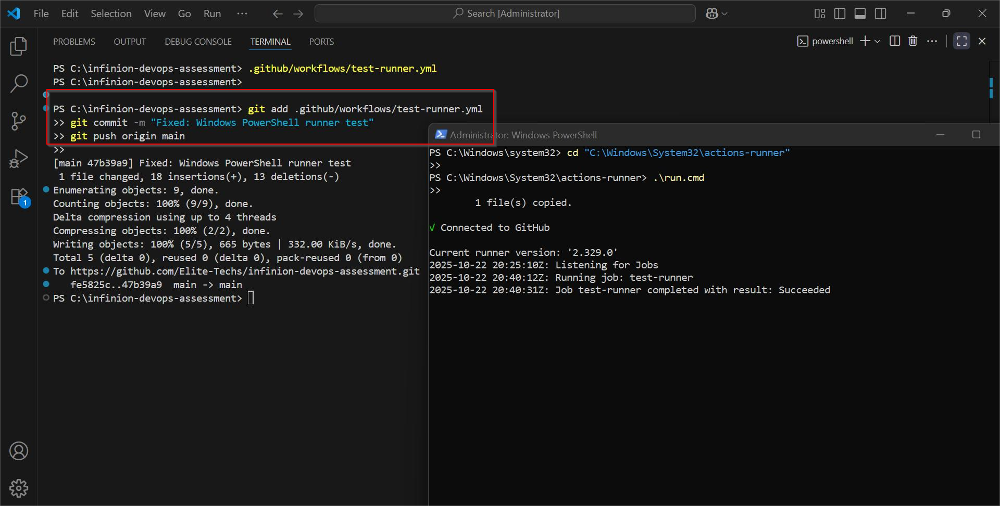
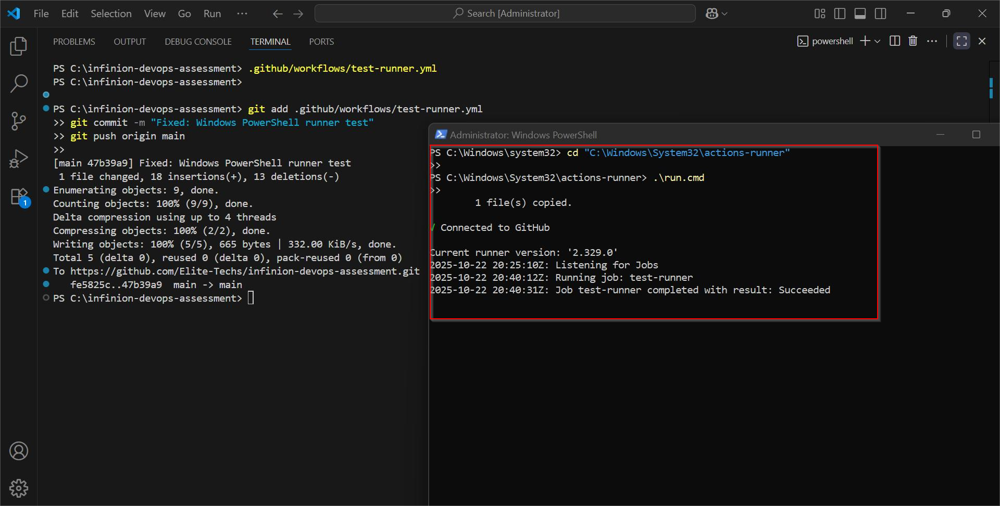
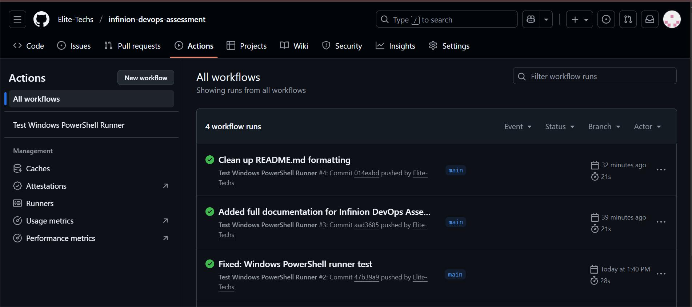

# 📸 Screenshots – Infinion DevOps Assessment

This folder contains key visuals demonstrating the **setup, configuration, and successful execution** of the self-hosted GitHub Actions runner for the Infinion DevOps Assessment.

Each image corresponds to a specific step in the workflow setup and validation process.

---

## Screenshots Table

Description | Filename | Preview
--- | --- | ---
🧰 Runner Configuration in PowerShell | `runner-configuration.png` | 
⚙️ Workflow YAML File in VS Code | `workflow-vscode.png` | 
💻 Local Git Commit & Push (VS Code Terminal) | `commit-push.png` | 
✅ Successful Workflow Execution | `workflow-success.png` | 
📊 GitHub Actions Dashboard (Success Status) | `dashboard-success.png` | 
